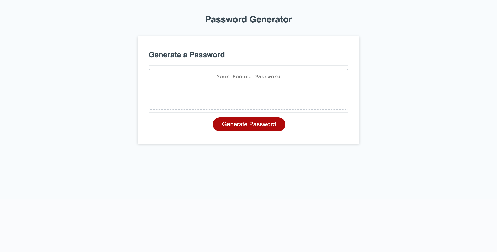

PASSWORD GENERATOR

Description: A password is randomly generated based on criteria that the user provides when prompted.

When the user clicks the button "Generate Password" they are first promoted for password length. If outside the range of 8-50, the user is prompted to once again enter a password lengthw within the range. The prompt will loop until the user enters a valid number.

The program then prompts the user to define if they would like to include numbers, characters, uppercase and/or lowercase letters. If the user selects none to all criteria, the program will ask it to select at least each one and will loop back through the prompts.

When all parameters have been defined, the password will appear within the password box.

Technologies Used: HTML5, CSS3, JavaScript

## Mock-Up

The following image shows the web application's appearance and functionality:

## Grading Requirements

This homework is graded based on the following criteria:

### Technical Acceptance Criteria: 40%

- Satisfies all of the preceding acceptance criteria plus the following:

  - The homework should not produce any errors in the console when you inspect it using Chrome DevTools.

### Deployment: 32%

- Application deployed at live URL.

- Application loads with no errors.

- Application GitHub URL submitted.

- GitHub repository that contains application code.

### Application Quality: 15%

- Application user experience is intuitive and easy to navigate.

- Application user interface style is clean and polished.

- Application resembles the mock-up functionality provided in the homework instructions.

### Repository Quality: 13%

- Repository has a unique name.

- Repository follows best practices for file structure and naming conventions.

- Repository follows best practices for class/id naming conventions, indentation, quality comments, etc.

- Repository contains multiple descriptive commit messages.

- Repository contains quality readme file with description, screenshot, and link to deployed application.

## Review

You are required to submit the following for review:

- The URL of the deployed application.

- The URL of the GitHub repository, with a unique name and a readme describing the project.

---

© 2021 Trilogy Education Services, LLC, a 2U, Inc. brand. Confidential and Proprietary. All Rights Reserved.

# password_generator
